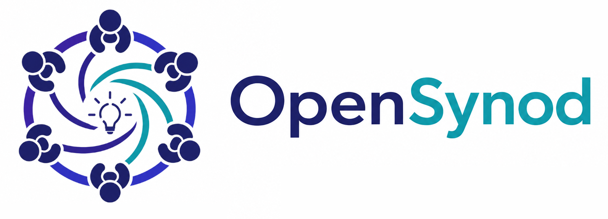

<p align="center">
  
</p>

**📖 [Documentation](https://vijayg10.github.io/opensynod/)**


## What is OpenSynod?

Instead of asking a single AI for an answer, OpenSynod convenes a **quorum** — a curated panel of AI agents, each backed by a different language model and assigned a distinct role. The agents privately commit initial positions, debate, challenge one another through a forced devil's advocate and a moderator, cite sources, and vote. The result is a structured, auditable recommendation backed by documented reasoning rather than one model's best guess.

> **About the name:** *synod* comes from the Greek *syn* ("together") and *hodos* ("road") — literally "a coming together." It has come to mean a deliberative assembly convened to debate an issue and reach a collective decision — exactly what a panel of agents does here.


## Quick Start

### Prerequisites

- Docker and Docker Compose
- At least one LLM provider API key (Anthropic, OpenAI, or Google)
- `openssl` (for generating JWT keys)

### 1. Clone and configure environment

```bash
git clone <repo-url>
cd opensynod
cp .env.example .env
```

### 2. Generate JWT keys

```bash
openssl genrsa -out private.pem 4096
openssl rsa -in private.pem -pubout -out public.pem
```

Paste the actual PEM content into `.env`. Run this to print the values ready to copy:

```bash
echo "JWT_PRIVATE_KEY=\"$(cat private.pem)\""
echo "JWT_PUBLIC_KEY=\"$(cat public.pem)\""
```


### 3. Configure LLM provider

By default the app uses **Ollama** (local models, no API key needed). Make sure Ollama is running:

```bash
ollama serve
```

If you want to use cloud providers instead, set one or more keys in `.env`:

```env
ANTHROPIC_API_KEY=sk-ant-...
OPENAI_API_KEY=sk-...
GOOGLE_API_KEY=...
```

### 4. Start all services

```bash
cd infra
docker compose up --build
```

This starts:
- **PostgreSQL** on port `5432`
- **Redis** on port `6379`
- **API** (FastAPI) on port `8000` — runs Alembic migrations automatically on startup
- **Worker** (Arq discussion orchestrator)
- **Frontend** (React/Vite) on port `5173`

### 5. Open the app

Navigate to `http://localhost:5173` in your browser.

The API docs (Swagger UI) are available at `http://localhost:8000/docs`.

---

## Local Development (without Docker)

### Backend

**Requirements:** Python 3.11+ and [`uv`](https://docs.astral.sh/uv/)

```bash
cd backend
uv sync
```

Start infrastructure dependencies (Postgres, Redis) via Docker:

```bash
cd infra
docker compose up postgres redis -d
```

Run migrations and start the API server:

```bash
cd backend
uv run alembic upgrade head
uv run uvicorn app.main:app --reload --port 8000
```

Start the Arq worker in a separate terminal:

```bash
uv run arq app.workers.arq_settings.WorkerSettings
```

### Frontend

**Requirements:** Node.js 20+

```bash
cd frontend
npm install
npm run dev
```

The dev server runs at `http://localhost:5173` and proxies `/api` and `/ws` requests to `http://localhost:8000` (override with `PROXY_API_TARGET`).

---

## Environment Variables

| Variable | Required | Description |
|---|---|---|
| `DATABASE_URL` | Yes | PostgreSQL connection string (`postgresql+asyncpg://...`) |
| `REDIS_URL` | Yes | Redis connection string (`redis://...`) |
| `JWT_PRIVATE_KEY` | Yes | RSA private key (PEM) for signing JWTs |
| `JWT_PUBLIC_KEY` | Yes | RSA public key (PEM) for verifying JWTs |
| `ANTHROPIC_API_KEY` | Optional* | Anthropic Claude API key |
| `OPENAI_API_KEY` | Optional* | OpenAI API key |
| `OPENAI_BASE_URL` | Optional | Override base URL for OpenAI-compatible endpoints (LiteLLM, OpenRouter, custom proxy) |
| `GOOGLE_API_KEY` | Optional* | Google Gemini API key |
| `OLLAMA_BASE_URL` | Optional | Ollama base URL (default: `http://localhost:11434`) |
| `OLLAMA_MODEL_PRIMARY` / `_REASONING` / `_EXPERT` / `_SUPPORT` | Optional | Ollama models per agent role (used when no cloud provider keys are set) |
| `MOCK_LLM_CALLS` | Optional | When `true`, replaces all LLM calls with canned responses — run without any API keys (default: `false`) |
| `SEARCH_PROVIDER` | Optional | Web search provider: `tavily`, `brave`, `bing`, or `serper` (default: `tavily`) |
| `TAVILY_API_KEY` | Optional | Tavily search API key |
| `BRAVE_API_KEY` | Optional | Brave Search API key |
| `SERPER_API_KEY` | Optional | Serper API key |
| `DEFAULT_ORG_COST_LIMIT_USD` | Optional | Default monthly LLM spend limit per organization (default: `100.0`) |
| `API_PREFIX` | Optional | URL prefix for REST endpoints (default: `/api/v1`) |
| `ENVIRONMENT` | Optional | `development` or `production` (default: `development`) |
| `LOG_LEVEL` | Optional | Log verbosity: `DEBUG`, `INFO`, `WARNING` (default: `INFO`) |

*At least one LLM provider key is required to run discussions, or set `MOCK_LLM_CALLS=true` to run without any keys.

---

## Running Tests

```bash
cd backend
uv run pytest tests/ -v
```

With coverage:

```bash
uv run pytest --cov=app --cov-report=term-missing
```
