# Screenshots

## Login

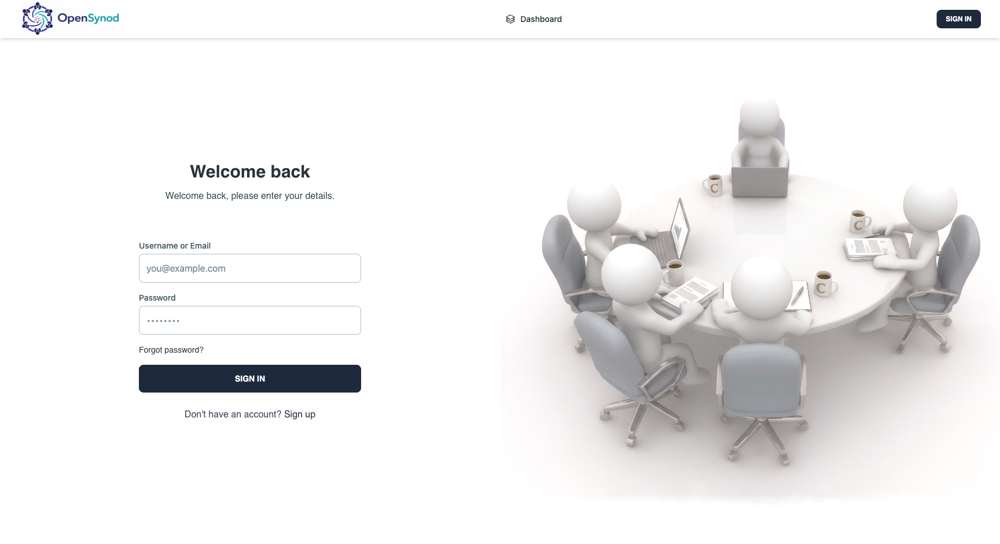

---

## Dashboard

Team discussion history, in-progress sessions, panel templates, and the Start Discussion button.

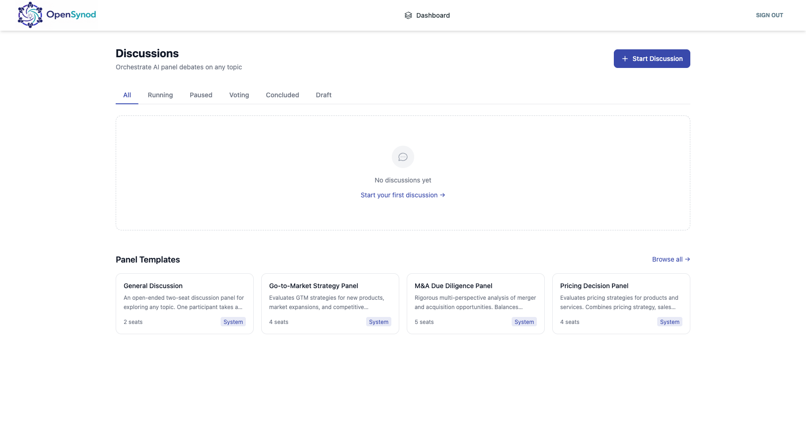

---

## Topic Setup

Define the decision question, desired outcome type (Recommendation / Exploration / Risk Assessment), and optional success criteria. The sidebar shows a live cost estimate.

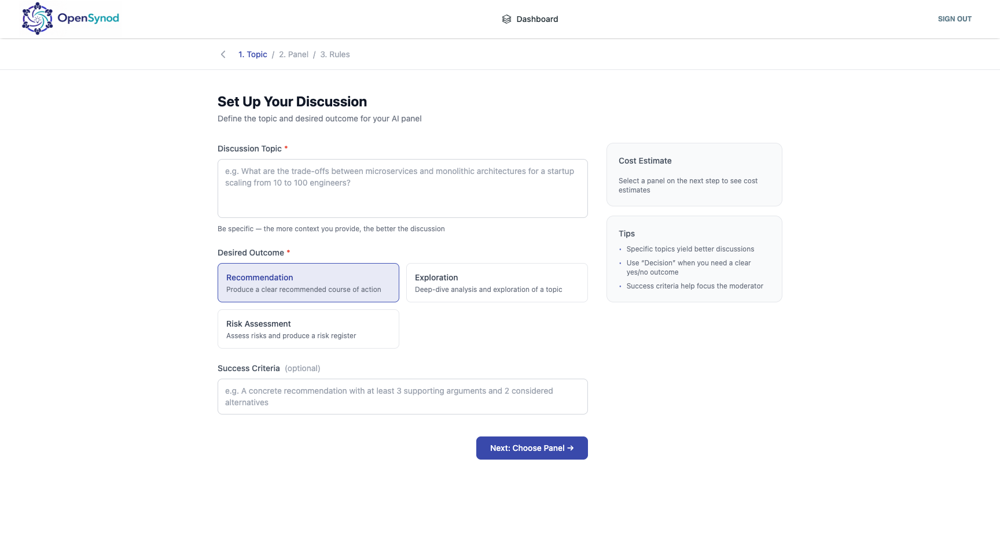

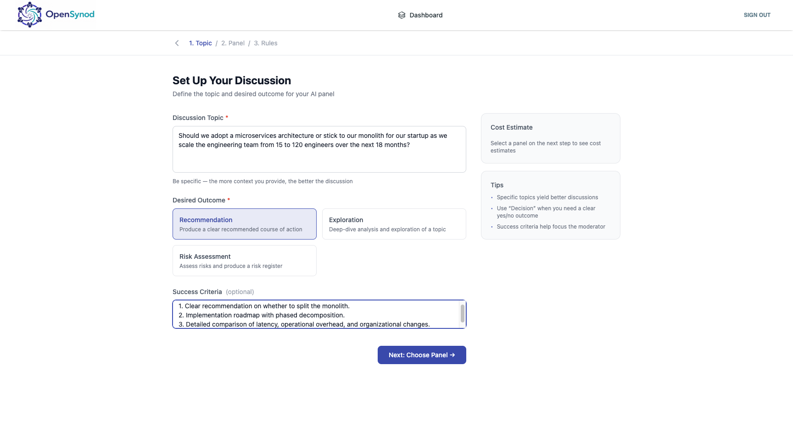

---

## Panel Selection

Choose from pre-built expert panels. Clicking a panel previews its agent roster, use cases, and model assignments.

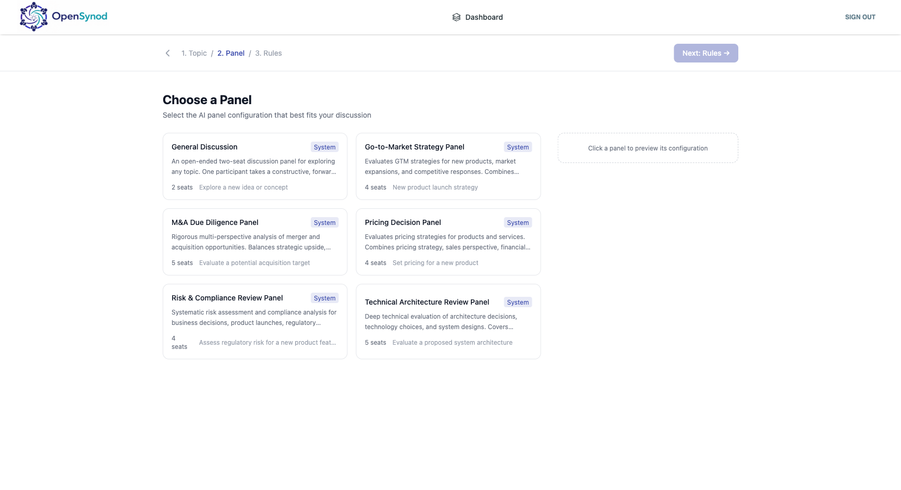

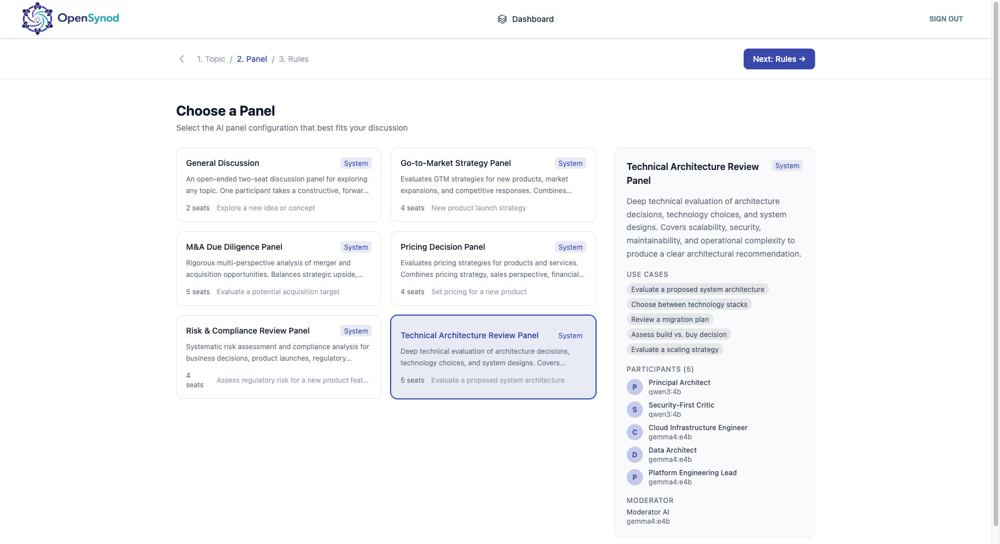

---

## Discussion Rules

Configure speaking order, behaviour toggles (human interventions, citations, agent anonymization), and turn limits.

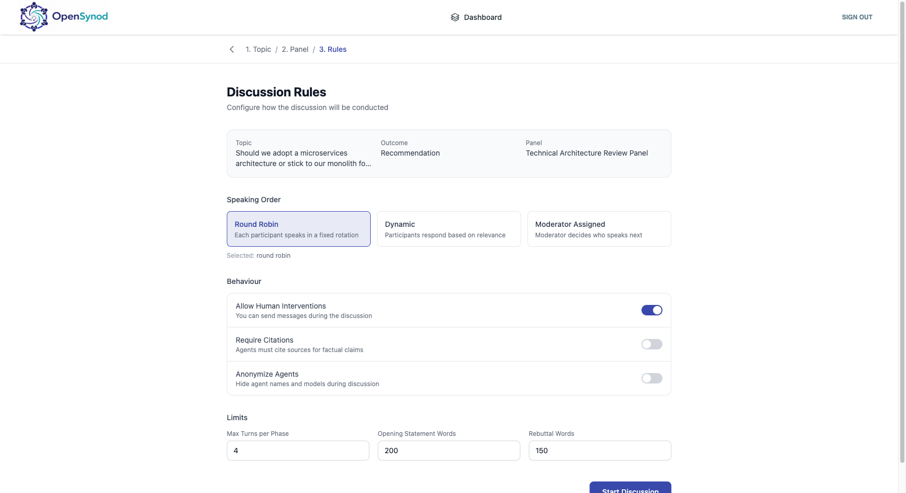

---

## Live Discussion — Round-Table View

The animated round-table showing all agent seats. The active speaker is highlighted. Status shows the current phase and elapsed time.

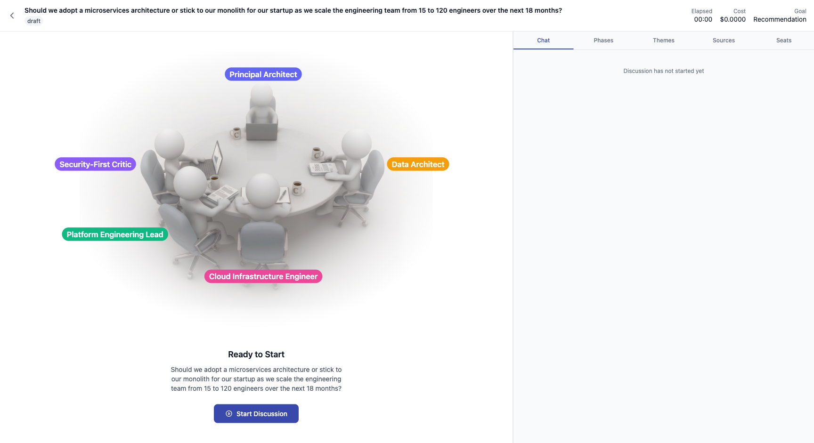

---

## Live Transcript

Token-by-token streaming transcript with agent labels, phase tags, and timestamps.

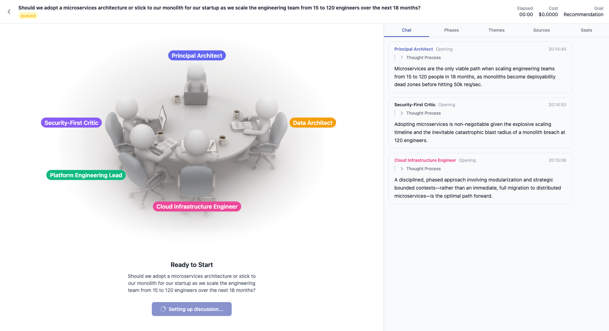

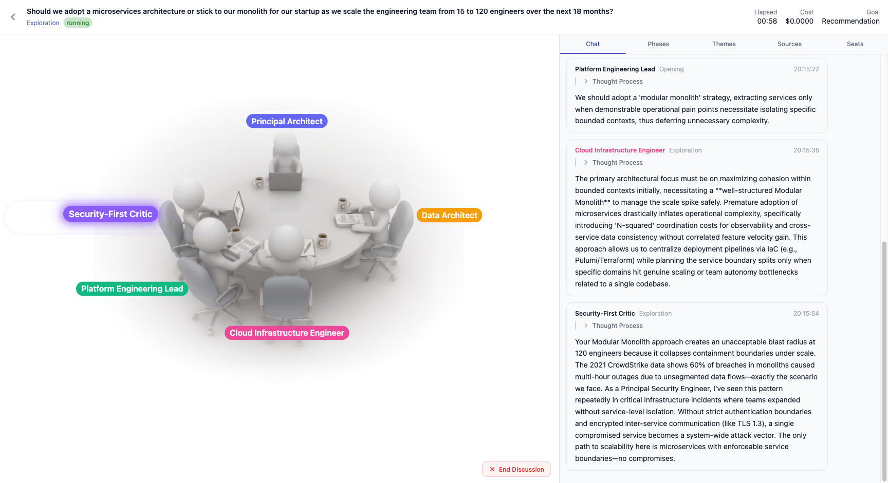

---

## Phases Tab

The five-stage discussion pipeline — Opening, Exploration, Debate, Convergence, Vote — with the current phase highlighted.

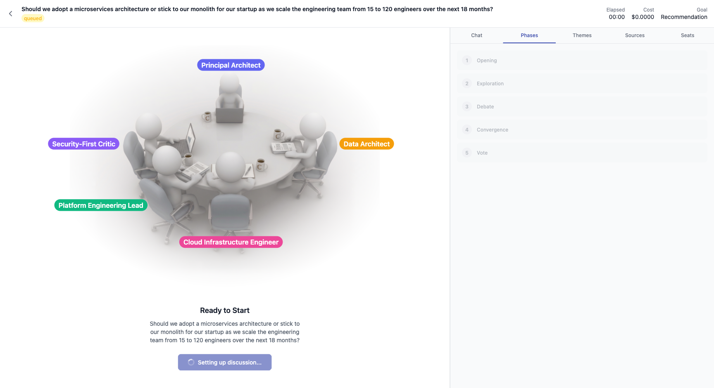

---

## Seats Tab

All agent seats and the Moderator, each showing their model assignment.

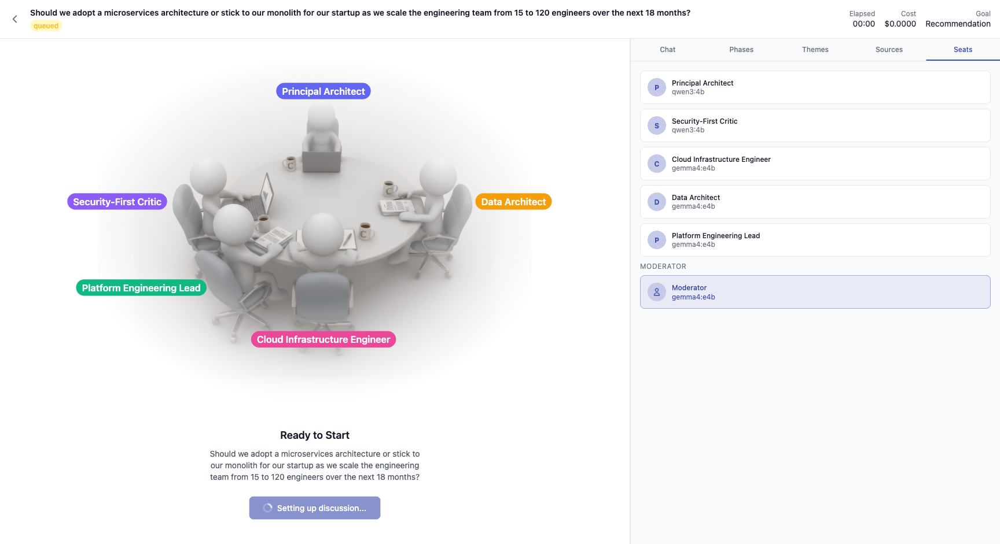
